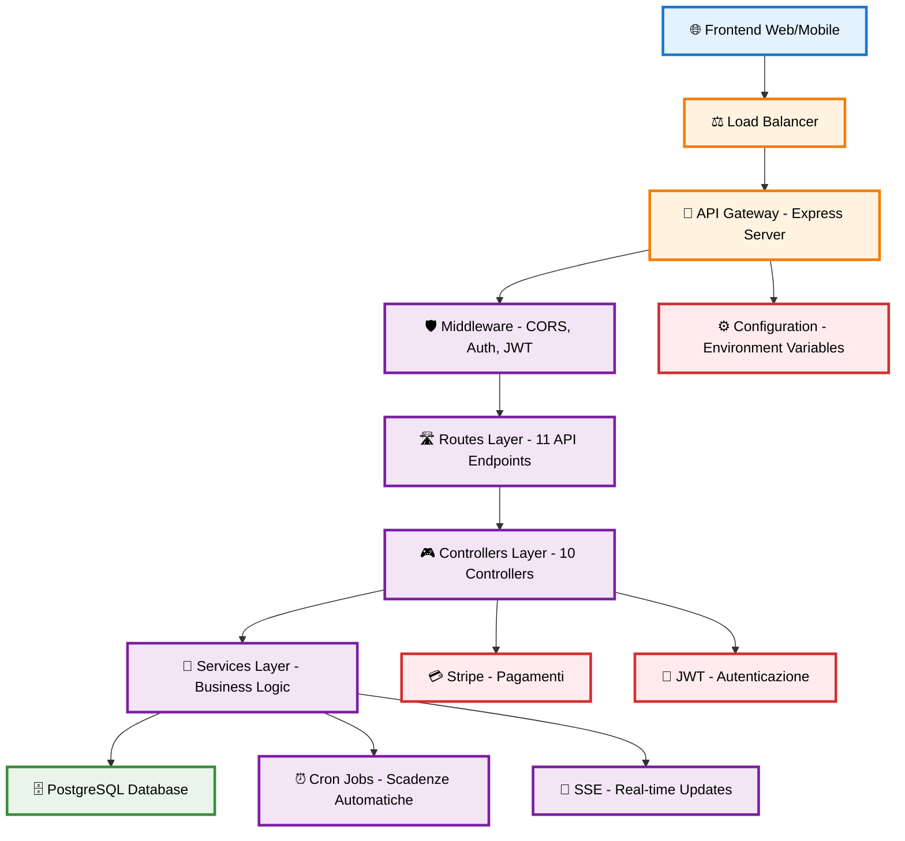

# ARCHITETTURA BACKEND E DATABASE - CoWorking

## Diagramma Architetturale - Schema ad Alto Livello



## Descrizione dell'Architettura

### **🏗️ Livelli Principali**

1. **🌐 Frontend**: Interfaccia web e mobile per gli utenti
2. **⚖️ Load Balancer**: Distribuzione del carico e bilanciamento
3. **🚪 API Gateway**: Server Express principale con gestione richieste
4. **🛡️ Middleware**: CORS, autenticazione JWT, validazione
5. **🛣️ Routes**: 11 endpoint API organizzati per funzionalità
6. **🎮 Controllers**: 10 controller per la logica di business
7. **🔧 Services**: Servizi specializzati e business logic
8. **🗄️ Database**: PostgreSQL per persistenza dati
9. **💳 Stripe**: Integrazione pagamenti online
10. **🔑 JWT**: Gestione autenticazione e token
11. **⏰ Cron Jobs**: Processi automatici per scadenze
12. **📡 SSE**: Server-Sent Events per aggiornamenti real-time

### **🔄 Flusso Principale**

```
Frontend → Load Balancer → API Gateway → Middleware → Routes → Controllers → Services → Database
```

### **🔗 Connessioni Chiave**

- **Autenticazione**: Controllers ↔ JWT Service
- **Pagamenti**: Controllers ↔ Stripe API
- **Real-time**: Services ↔ SSE
- **Automazione**: Services ↔ Cron Jobs
- **Configurazione**: Gateway ↔ Environment Variables

### **📊 Caratteristiche Architetturali**

- **Modulare**: Separazione chiara delle responsabilità
- **Scalabile**: Ogni livello può essere scalato indipendentemente
- **Sicuro**: Middleware di autenticazione e autorizzazione
- **Performante**: Pool di connessioni database e ottimizzazioni
- **Manutenibile**: Struttura pulita e ben organizzata

---

*Schema architetturale ad alto livello per il progetto CoWorking - Sistema di Gestione Spazi di Coworking*
